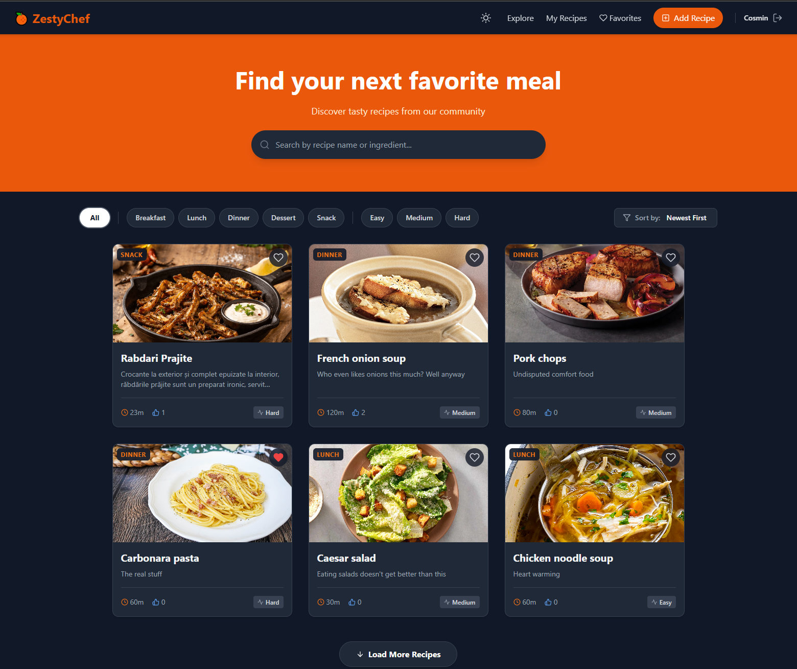

# 🍊 ZestyChef


**ZestyChef** is a modern, social culinary platform designed for food enthusiasts to share, discover, and manage their favorite recipes. Built with a serverless architecture using **React** and **Firebase**, it offers a seamless and responsive user experience with features like dark mode, real-time updates, and advanced filtering.

🔗 **Live Demo:** [Click here to visit ZestyChef](https://zestychef.netlify.app/)

---

## 📸 Screenshots



---

## ✨ Key Features

### 🍳 Recipe Management
-   **Create & Edit:** Users can publish their own recipes with ingredients, steps, cooking time, and image uploads.
-   **Rich Details:** Comprehensive recipe views including difficulty levels, categories, and vegetarian tags.
-   **Dashboard:** A private area to manage published content.

### 🔍 Discovery & Navigation
-   **Advanced Filtering:** Filter by Category (Breakfast, Lunch, etc.) and Difficulty.
-   **Smart Search:** Real-time search by recipe title or ingredients.
-   **Sorting:** Sort by Newest, Oldest, or Most Popular.
-   **Pagination:** "Load More" functionality for optimized performance.

### 👤 User Experience
-   **Authentication:** Secure Login and Registration powered by Firebase Auth.
-   **Social Interactions:** Like recipes and see real-time counters.
-   **Favorites:** Save recipes to a personal "Favorites" collection.
-   **Dark Mode:** Fully supported system-wide dark/light theme toggle.
-   **Responsive Design:** Mobile-first approach using Tailwind CSS.

---

## 🛠️ Tech Stack

-   **Frontend:** React 18, Vite
-   **Styling:** Tailwind CSS
-   **Backend-as-a-Service:** Firebase (Authentication, Firestore Database, Storage)
-   **Routing:** React Router DOM
-   **Testing:** Vitest, React Testing Library, JSDOM
-   **Notifications:** React Hot Toast
-   **Icons:** React Icons
-   **Deployment:** Netlify

---

## 🚀 Getting Started

Follow these steps to run the project locally on your machine.

### Prerequisites
-   Node.js (v14 or higher)
-   npm or yarn

### Installation

1.  **Clone the repository**
    ```bash
    git clone https://github.com/cosmiinnn/recipe_platform.git
    cd ZestyChef
    ```

2.  **Install dependencies**
    ```bash
    npm install
    ```

3.  **Configure Firebase**
    -   Create a project at [Firebase Console](https://console.firebase.google.com/).
    -   Enable **Authentication** (Email/Password).
    -   Enable **Firestore Database**.
    -   Enable **Storage**.
    -   Get your web configuration keys.

4.  **Setup Environment Variables**
    -   Create a `.env` file in the root directory.
    -   Add your Firebase config keys as follows:

    ```env
    VITE_API_KEY=your_api_key
    VITE_AUTH_DOMAIN=your_project_id.firebaseapp.com
    VITE_PROJECT_ID=your_project_id
    VITE_STORAGE_BUCKET=your_project_id.appspot.com
    VITE_MESSAGING_SENDER_ID=your_sender_id
    VITE_APP_ID=your_app_id
    VITE_MEASUREMENT_ID=your_measurement_id
    ```

5.  **Run the App**
    ```bash
    npm run dev
    ```

---

## 🧪 Testing

The application ensures code reliability through a suite of Unit and Component tests powered by **Vitest**.

### Running Tests
To execute the test suite, run the following command in your terminal:

```bash
npm run test
```

---

## 📂 Project Structure

```text
src/
├── components/       # Reusable UI components (Navbar, RecipeCard)
├── context/          # React Contexts (Auth, Theme, Favorites)
├── pages/            # Page components (Home, Login, Dashboard, etc.)
├── test/             # Test setup and configuration
├── utils/            # Helper functions
├── firebase.js       # Firebase configuration
├── main.jsx          # Entry point
└── App.jsx           # Main routing layout
```
